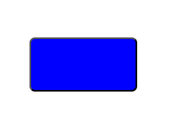
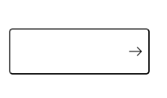
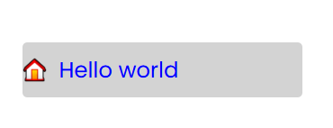
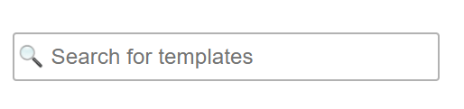
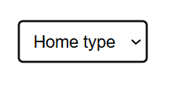
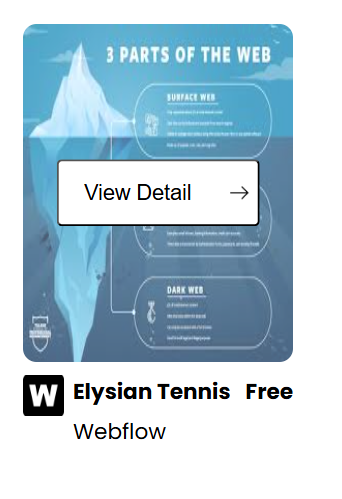
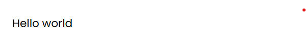
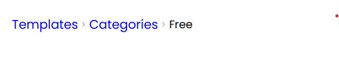

# Button
 <br>
VD: <br>
```javascript 
<Button text={"Hello world"} />
```

# ButtonWithArrow


# FeatureWithIcon
 <br>
VD: <br>
```javascript 
<FeatureWithIcon
    iconPath={assets.Home_icon}
    text={"Hello world"}
/>
```

# SearchWithIcon
 <br>


# SelectBox
 <br>
VD: <br>
```javascript 
<SelectBox text={"Home type"} />
```

# WebsiteDesc
 <br>
VD: <br>
```javascript 
<WebsiteDesc
    imgPath={assets.web_img}
    iconPath={assets.w_icon}
    name={"Elysian Tennis"}
    source={"Webflow"}
    money={"Free"}
/>
```

# Link
 <br>
VD: <br>
```javascript 
<Link text={"Hello world"} />
```

# LinkWithImage
 <br>
VD: <br>
```javascript 
<LinkWithImage iconPath={assets.Youtube_icon} link={"#"} />
```

# PartOfAddress
 <br>

